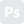
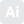
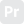

# Fullstack Web Developer & 3D Artist

<table>

<tr>
  <td colspan="2" align="center">

  <!-- Contacts & Social Media -->
  ### **Contacts & Social Media**
  

    
    
    
    
  

  </td>

</tr>
<!------------------------------------------------------------->
<tr>

<!-- Programming languages -->
<td>
  

  ### **Programming Languages**
  

    
    
    <!--  -->
    

  

  

    
    
    <!--  -->
    <!--  -->
    <!--  -->
  

  

</td>

<!-- Frameworks -->
<td>
  

  ### **Frameworks**
  

    
    
    
    
  

  

    
    
    
    
  

  

</td>

</tr>
<!------------------------------------------------------------->
<tr>

<!-- Testing -->
<td>
  

  ### **Testing**
  

    
    
    
    
  

  

</td>

<!-- Systems & Databases -->
<td>
  

  ### **Systems & Databases**
  

    
    
    
  

  

</td>

</tr>
<!------------------------------------------------------------->
<tr>

<!-- 3D & others -->
<td colspan="2" align="center">
  

  ### **3D & others**
  

    
    
    
    
    
    
  

  

    
    
    
    
    
    
  

  

    
  

  </td>
</tr>
<!------------------------------------------------------------->
</table>

 

<!--

https://streak-stats.demolab.com?user=AlexTamayo
&theme=dark
&ring=CC0000
&fire=CC0000
&hide_border=true
&border_radius=15
&currStreakLabel=CCCCCC
&hide_current_streak=true
&date_format=j%20M%5B%20Y%5D
&background=0D1117

 -->

  
  

  <!--  -->

 

  

